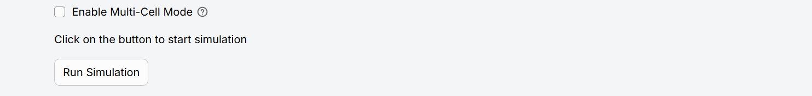
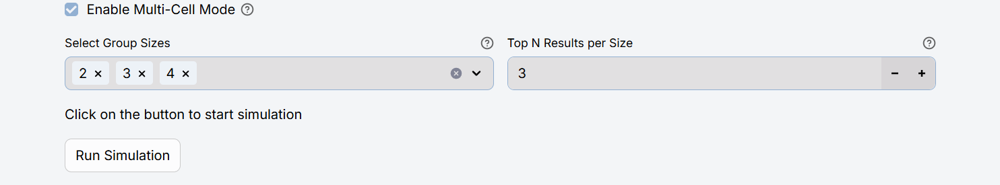
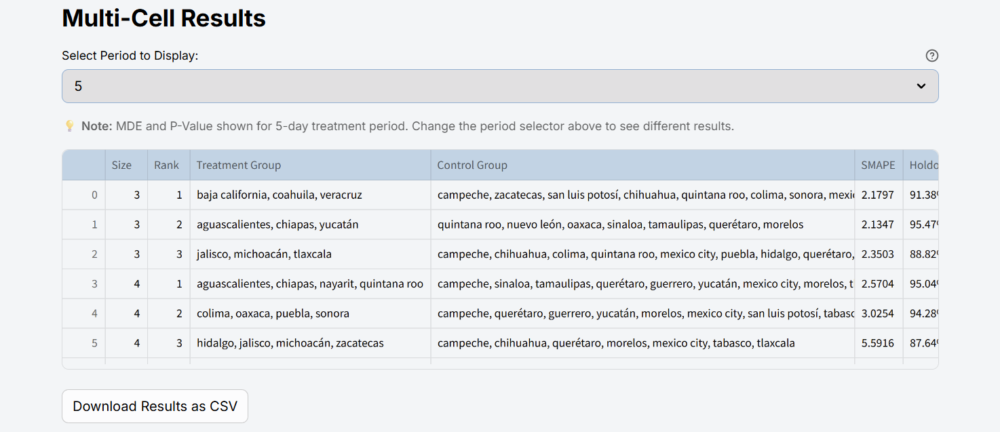

# Multi-cell Experiments

A **multi-cell experiment** splits the universe of geographic locations into **multiple cells**, each with its own treatment locations while sharing the exact same treatment window. This design solves questions that a classic single-cell A/B test cannot—for instance, comparing **A/B/C…**, Meta vs. Google Brand vs. P-Max, different budget levels, or multiple creatives simultaneously.

> **Quick recap**  •  *Cell* = subset of geographic locations.  *Multi-cell* = several cells running inside one experiment.

## Why run multi-cells?

1. **Compare channels or campaigns** – e.g. Channel A vs. Channel B.  
2. **Test budget levels** – 100 %, 75 %, 50 % spend.  
3. **Save time** – multiple hypotheses answered in a single experiment.

With a solid multi-cell design you avoid running many single-cell experiments back-to-back, saving both time and budget.

## How Murray defines Multi-cells

| Concept | Description |
|---------|-------------|
| **Select Group Sizes** | Sizes of the treatment groups that each cell will use. |
| **Top N Results per Size** | How many top-ranked cells you want to keep for every group size. |

Every experiment must also set the parameters explained in the [Walkthrough](./Murray%20Python%20Package/Walkthrough) (Python package) or the [User Guide](./tutorial-extras/User%20Guide) (Streamlit app).

## Multi-cell design in the Streamlit app

The [User Guide](./tutorial-extras/User%20Guide) explains the standard design flow. To create a multi-cell experiment you follow the same steps, but tick the **Enable multi-cells** checkbox that Murray adds.

Once multi-cell mode is on, two new inputs appear—*Select Group Sizes* and *Top N Results per Size*. The app provides sensible defaults, but you can adjust them as needed.

:::note
Keep the total number of available locations in mind when picking group sizes: very large treatment groups may leave too few locations for control.
:::

After execution finishes, the app shows a results table:

A period selector lets you switch between treatment windows. The table contains:

* **Size** – Number of locations (geo-units) in the treatment group of that cell.  
* **Rank** – Position within its size bucket, ordered by error metrics (MAPE, SMAPE).  
* **Treatment Group** – Locations in the treatment group.  
* **Control Group** – Locations in the control group used to build the counterfactual.  
* **SMAPE** – Symmetric Mean Absolute Percentage Error between the actual series and its counterfactual; lower = better fit.  
* **Holdout** – Share of the target variable left out of treatment (size of the control group) to secure statistical power.  
* **MDE** – Minimum Detectable Effect: the smallest lift the experiment can detect at the chosen power and significance level.  
* **Period** – Treatment window length (days) evaluated for that cell.  
* **P-Value** – Permutation-test p-value; probability of observing an effect at least this extreme under the null of no impact.

## Best practices

1. **Physical separation** – Avoid spill-over between neighbouring locations.  
2. **Temporal consistency** – All cells start and end on the same dates.

