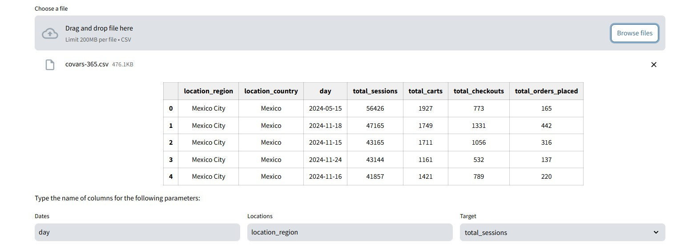
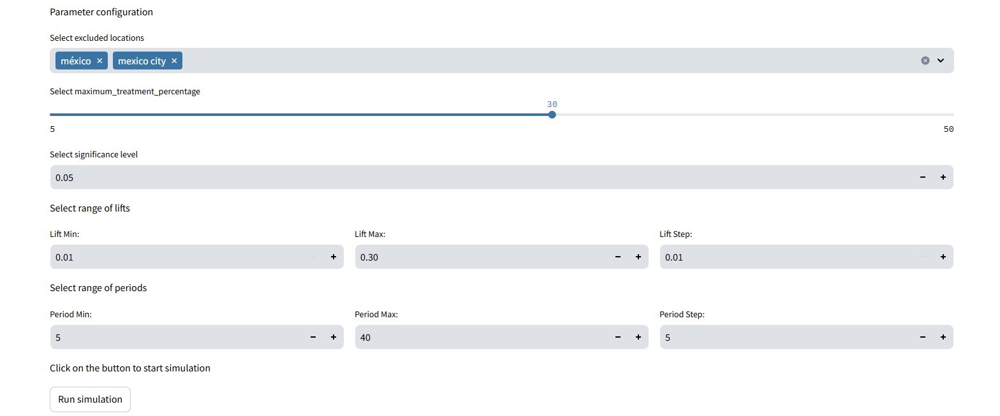

# User Guide

The Streamlit app was developed to enhance user options for conducting geographic lift experiments. While the Python package is easy to use, the Streamlit app makes it even more accessible. The workflow of this tool consists of four steps—two mandatory and two optional, with the latter providing additional insight.

## Experimental Design 

### 1. Upload Data
The first step is to upload the data file. Once the data is uploaded, the next two steps are automatically displayed. Additionally, a general visualization of your data is shown, along with three parameters that you need to enter for the analysis: the column names for Dates, Locations, and Target.

### 2. Data visualization 
With the analysis parameters defined, you have the option to visualize a graph of your data by simply pressing the "Graph data" button.

### 3. Experimental Design
Now, it's time to design the experiment which requires entering configuration parameters. In this case, those parameters are the same as those used for the Python package: Excluded locations, Minimum holdout percentage, Significance level, range of lifts, and range of periods. To start the execution, you just need to press the "Run simulation" button. 

At the end of the simulation, a heatmap is displayed according to the entered configurations, showing the behavior of different treatment groups over the specified periods. The chart is interactive, so when clicking on a cell, the holdout percentage, treatment group, and selected control group are displayed.

### 4. Generate report of results

Finally, from the experiment selected in the heatmap, it is possible to generate and download a report of the experiment's results; you just need to press the "Generate and Download PDF" button.

